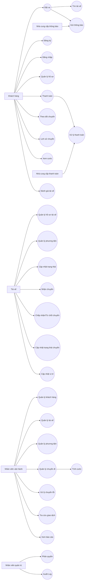

# PHÂN TÍCH YÊU CẦU HỆ THỐNG CAB SYSTEM

## Bước 1. Đọc và phân tích yêu cầu sơ khởi của khách hàng

### 1.1. Thông tin tổng quan

* **Tên dự án:** CAB System – Nền tảng đặt xe
* **Khách hàng:** Công ty ABC
* **Thời gian xây dựng và triển khai:** 7 tuần
* **Mục tiêu:** Xây dựng nền tảng đặt xe có khả năng phục vụ số lượng lớn khách hàng và tài xế, đồng thời có khả năng mở rộng trong tương lai. 

### 1.2. Các vấn đề hiện tại

* Phân công tài xế chủ yếu thực hiện thủ công.
* Khách hàng khó theo dõi trạng thái chuyến đi.
* Thông tin thanh toán chưa được quản lý tập trung.
* Bộ phận vận hành gặp khó khăn khi mở rộng hệ thống. 

### 1.3. Các nhóm chức năng chính

**Khách hàng**

* Đăng ký tài khoản.
* Đăng nhập.
* Cập nhật thông tin cá nhân.
* Nhập điểm đón, điểm đến.
* Lựa chọn loại xe.
* Đặt xe.
* Theo dõi chuyến đi.
* Xem lịch sử chuyến đi.
* Xem số tiền phải trả.
* Đánh giá tài xế. 

**Tài xế**

* Đăng ký hoặc được nhân viên tạo tài khoản.
* Cập nhật hồ sơ.
* Quản lý thông tin phương tiện.
* Cập nhật trạng thái hoạt động.
* Chuyển sang trạng thái sẵn sàng nhận chuyến.
* Nhận thông báo chuyến mới.
* Chấp nhận/từ chối chuyến.
* Cập nhật trạng thái chuyến.
* Cập nhật vị trí tài xế. 

**Hệ thống điều phối**

* Tìm tài xế phù hợp.
* Ưu tiên tài xế gần khách hàng.
* Xử lý trường hợp tài xế không phản hồi/từ chối.
* Tiếp tục tìm tài xế khác.
* Thông báo khi không tìm được tài xế. 

**Thanh toán**

* Tính cước.
* Thanh toán tiền mặt.
* Thanh toán điện tử.
* Tích hợp nhà cung cấp thanh toán bên ngoài.
* Không lưu thông tin nhạy cảm của thẻ/tài khoản thanh toán.
* Xử lý khi thanh toán điện tử thất bại. 

**Thông báo**

* Thông báo nhận yêu cầu đặt xe.
* Thông báo tài xế nhận chuyến.
* Thông báo tài xế đến điểm đón.
* Thông báo chuyến hoàn thành.
* Thông báo kết quả thanh toán.
* Thông báo chuyến mới/thay đổi chuyến cho tài xế.
* Có khả năng mở rộng thêm kênh thông báo. 

**Quản trị và vận hành**

* Quản lý khách hàng.
* Quản lý tài xế.
* Quản lý phương tiện.
* Quản lý chuyến đi.
* Theo dõi chuyến đang diễn ra.
* Kiểm tra trạng thái tài xế.
* Xử lý chuyến bị lỗi.
* Tra cứu lịch sử giao dịch.
* Phân quyền quản trị.
* Báo cáo hoạt động. 

---

# Bước 2. Xác định các Stakeholder

| Stakeholder             | Vai trò                      | Nhu cầu                                            |
| ----------------------- | ---------------------------- | -------------------------------------------------- |
| Khách hàng              | Sử dụng dịch vụ đặt xe       | Đặt xe, theo dõi chuyến, thanh toán, đánh giá      |
| Tài xế                  | Cung cấp dịch vụ vận chuyển  | Nhận chuyến, cập nhật trạng thái, cập nhật vị trí  |
| Nhân viên vận hành      | Điều phối và hỗ trợ hệ thống | Quản lý khách hàng, tài xế, chuyến đi, xử lý sự cố |
| Nhân viên quản trị      | Quản trị hệ thống            | Quản lý quyền, dữ liệu và thao tác nhạy cảm        |
| Ban lãnh đạo            | Quản lý doanh nghiệp         | Theo dõi báo cáo, doanh thu, hiệu quả hoạt động    |
| Nhà cung cấp thanh toán | Xử lý thanh toán điện tử     | Tiếp nhận và trả kết quả giao dịch                 |
| Nhà cung cấp thông báo  | Cung cấp kênh gửi thông báo  | Gửi thông báo đến khách hàng/tài xế                |

---

# Bước 3. Xác định Business Goal

### BG-01. Số hóa quy trình đặt xe

Xây dựng nền tảng CAB hỗ trợ toàn bộ quy trình từ đặt xe, tìm tài xế, thực hiện chuyến, tính cước, thanh toán đến đánh giá.

### BG-02. Nâng cao hiệu quả điều phối

Tự động tìm và ưu tiên tài xế phù hợp, gần khách hàng, đồng thời xử lý trường hợp tài xế từ chối hoặc không phản hồi.

### BG-03. Nâng cao trải nghiệm khách hàng

Cho phép khách hàng theo dõi tài xế, trạng thái chuyến đi, chi phí và kết quả thanh toán.

### BG-04. Tập trung quản lý vận hành

Cho phép nhân viên vận hành quản lý khách hàng, tài xế, phương tiện, chuyến đi và giao dịch trên một hệ thống.

### BG-05. Hỗ trợ mở rộng hệ thống

Kiến trúc phải cho phép mở rộng số lượng người dùng, bổ sung dịch vụ, phương thức thanh toán và nhà cung cấp thông báo. 

### BG-06. Đảm bảo tính ổn định và bảo mật

Hệ thống phải hoạt động ổn định khi tải tăng, bảo vệ dữ liệu và kiểm soát quyền truy cập. 

---

# Bước 4. Xác định phạm vi yêu cầu (Scope)

## 4.1. In Scope

* Quản lý tài khoản khách hàng.
* Quản lý tài khoản tài xế.
* Quản lý hồ sơ và phương tiện.
* Đặt xe.
* Tìm và phân công tài xế.
* Theo dõi chuyến đi.
* Cập nhật trạng thái chuyến.
* Theo dõi vị trí tài xế.
* Tính cước.
* Thanh toán tiền mặt/điện tử.
* Tích hợp nhà cung cấp thanh toán.
* Gửi thông báo.
* Quản lý vận hành.
* Tra cứu giao dịch.
* Báo cáo.
* Phân quyền.
* Ghi log các thao tác quan trọng.
* Hỗ trợ khả năng mở rộng. 

## 4.2. Out of Scope / Chưa xác định

Tài liệu chưa chốt chi tiết:

* Công thức tính cước.
* Tiêu chí ưu tiên tài xế.
* Thời gian tài xế phải phản hồi.
* Chính sách hủy chuyến.
* Cách xử lý khi mất kết nối mạng.
* Thời gian lưu trữ dữ liệu. 

> Các nội dung trên cần được Business Analyst làm rõ với stakeholder trước khi phát triển.

---

# Bước 5. Thiết kế Business Requirement

| BR ID | Business Requirement                                                             |
| ----- | -------------------------------------------------------------------------------- |
| BR-01 | Hệ thống phải hỗ trợ khách hàng đăng ký, đăng nhập và quản lý thông tin cá nhân. |
| BR-02 | Hệ thống phải hỗ trợ khách hàng tạo yêu cầu đặt xe.                              |
| BR-03 | Hệ thống phải tự động tìm tài xế phù hợp cho chuyến đi.                          |
| BR-04 | Hệ thống phải cho phép tài xế nhận hoặc từ chối chuyến.                          |
| BR-05 | Hệ thống phải cho phép theo dõi và cập nhật trạng thái chuyến đi.                |
| BR-06 | Hệ thống phải hỗ trợ lưu thông tin vị trí tài xế.                                |
| BR-07 | Hệ thống phải tính cước và hỗ trợ thanh toán.                                    |
| BR-08 | Hệ thống phải tích hợp với nhà cung cấp thanh toán bên ngoài.                    |
| BR-09 | Hệ thống phải gửi thông báo cho khách hàng và tài xế.                            |
| BR-10 | Hệ thống phải hỗ trợ nhân viên vận hành quản lý dữ liệu và xử lý sự cố.          |
| BR-11 | Hệ thống phải hỗ trợ báo cáo vận hành và doanh thu.                              |
| BR-12 | Hệ thống phải kiểm soát quyền truy cập và bảo vệ dữ liệu.                        |
| BR-13 | Hệ thống phải hoạt động ổn định khi tải tăng.                                    |
| BR-14 | Hệ thống phải có khả năng mở rộng và bổ sung chức năng trong tương lai.          |

---

# Bước 6. Xây dựng Business Process

## 6.1. Quy trình đặt xe

```text
Khách hàng
   ↓
Đăng nhập
   ↓
Nhập điểm đón + điểm đến
   ↓
Chọn loại xe
   ↓
Tạo yêu cầu đặt xe
   ↓
Hệ thống tiếp nhận yêu cầu
   ↓
Tìm tài xế phù hợp
   ↓
Gửi yêu cầu cho tài xế
   ↓
Tài xế chấp nhận?
 ┌───────┴────────┐
Có                Không
↓                   ↓
Xác nhận tài xế    Tìm tài xế khác
↓                   ↓
Tài xế đến điểm đón ←
↓
Đón khách
↓
Di chuyển
↓
Hoàn thành chuyến
↓
Tính cước
↓
Thanh toán
↓
Thông báo kết quả
↓
Khách hàng đánh giá
```

## 6.2. Quy trình điều phối tài xế

```text
Nhận yêu cầu đặt xe
        ↓
Xác định tài xế phù hợp
        ↓
Ưu tiên tài xế gần khách hàng
        ↓
Gửi yêu cầu
        ↓
Tài xế phản hồi?
   ┌────┴─────┐
 Chấp nhận  Từ chối/Không phản hồi
   ↓                ↓
Gán tài xế      Tìm tài xế tiếp theo
   ↓                ↓
   └──────→ Xác nhận chuyến
                    ↓
          Không còn tài xế?
             ┌──────┴─────┐
            Có            Không
            ↓               ↓
      Thông báo khách   Tiếp tục chuyến
```

---

# Bước 7. Phân rã yêu cầu nghiệp vụ

## BR-01. Quản lý tài khoản

* FR-01: Đăng ký tài khoản.
* FR-02: Đăng nhập.
* FR-03: Cập nhật thông tin cá nhân.

## BR-02. Đặt xe

* FR-04: Nhập điểm đón.
* FR-05: Nhập điểm đến.
* FR-06: Chọn loại xe.
* FR-07: Tạo yêu cầu đặt xe.

## BR-03. Tìm và phân công tài xế

* FR-08: Xác định tài xế phù hợp.
* FR-09: Xếp hạng/ưu tiên tài xế.
* FR-10: Gửi yêu cầu nhận chuyến.
* FR-11: Xử lý tài xế từ chối.
* FR-12: Xử lý tài xế không phản hồi.
* FR-13: Thông báo không tìm được tài xế.

## BR-04. Thực hiện chuyến

* FR-14: Cập nhật vị trí tài xế.
* FR-15: Cập nhật trạng thái chuyến.
* FR-16: Theo dõi chuyến đi.
* FR-17: Hoàn thành chuyến.

## BR-05. Thanh toán

* FR-18: Tính cước.
* FR-19: Thanh toán tiền mặt.
* FR-20: Thanh toán điện tử.
* FR-21: Xử lý thanh toán thất bại.

## BR-06. Thông báo

* FR-22: Gửi thông báo cho khách hàng.
* FR-23: Gửi thông báo cho tài xế.
* FR-24: Quản lý kênh thông báo.

## BR-07. Quản trị vận hành

* FR-25: Quản lý khách hàng.
* FR-26: Quản lý tài xế.
* FR-27: Quản lý phương tiện.
* FR-28: Quản lý chuyến đi.
* FR-29: Tra cứu giao dịch.
* FR-30: Xử lý chuyến lỗi.
* FR-31: Phân quyền người dùng.
* FR-32: Xem báo cáo.

---

# Bước 8. Thiết kế Business Rules và Acceptance

## 8.1. Business Rules

| Rule ID  | Business Rule                                                                                                      |
| -------- | ------------------------------------------------------------------------------------------------------------------ |
| BRULE-01 | Khách hàng phải đăng nhập trước khi sử dụng chức năng yêu cầu tài khoản.                                           |
| BRULE-02 | Tài xế chỉ được nhận chuyến khi ở trạng thái sẵn sàng.                                                             |
| BRULE-03 | Hệ thống ưu tiên tài xế phù hợp và gần khách hàng.                                                                 |
| BRULE-04 | Khi tài xế từ chối hoặc không phản hồi, hệ thống tiếp tục tìm tài xế khác.                                         |
| BRULE-05 | Khi không tìm được tài xế, hệ thống phải thông báo rõ ràng cho khách hàng.                                         |
| BRULE-06 | Chuyến hoàn thành phải được tính cước trước khi xử lý thanh toán.                                                  |
| BRULE-07 | Hệ thống không lưu trực tiếp thông tin nhạy cảm của thẻ/tài khoản thanh toán.                                      |
| BRULE-08 | Thanh toán điện tử thất bại phải được thông báo cho khách hàng và cho phép xử lý lại theo chính sách doanh nghiệp. |
| BRULE-09 | Chỉ người dùng có quyền mới được thực hiện thao tác quản trị nhạy cảm.                                             |
| BRULE-10 | Các thao tác quan trọng phải được lưu vết.                                                                         |

Các quy tắc trên được suy ra trực tiếp từ các yêu cầu vận hành, thanh toán và bảo mật trong tài liệu.  

## 8.2. Acceptance sơ bộ

| ID    | Acceptance                                                                   |
| ----- | ---------------------------------------------------------------------------- |
| AC-01 | Khách hàng đăng ký và đăng nhập thành công.                                  |
| AC-02 | Khách hàng tạo được yêu cầu đặt xe với điểm đón, điểm đến và loại xe.        |
| AC-03 | Hệ thống tìm được tài xế phù hợp và gửi yêu cầu nhận chuyến.                 |
| AC-04 | Khi tài xế từ chối/không phản hồi, hệ thống tự động chuyển sang tài xế khác. |
| AC-05 | Khách hàng theo dõi được trạng thái chuyến.                                  |
| AC-06 | Chuyến hoàn thành được tính cước chính xác theo quy định đã xác nhận.        |
| AC-07 | Thanh toán điện tử thành công được ghi nhận và thông báo.                    |
| AC-08 | Thanh toán thất bại được thông báo và có cơ chế xử lý lại.                   |
| AC-09 | Nhân viên có quyền có thể quản lý dữ liệu tương ứng.                         |
| AC-10 | Người không có quyền không thực hiện được thao tác quản trị nhạy cảm.        |

> Công thức tính cước và các chính sách liên quan chưa được khách hàng chốt nên AC-06 cần hoàn thiện sau khi xác nhận business rule. 

---

# Bước 9. Data Modeling

## 9.1. Các thực thể chính

| Entity         | Một số thuộc tính                                                                    |
| -------------- | ------------------------------------------------------------------------------------ |
| Customer       | CustomerID, Name, Phone, Email, Password, Status                                     |
| Driver         | DriverID, Name, Phone, License, Status, Rating                                       |
| Vehicle        | VehicleID, DriverID, Type, PlateNumber, Status                                       |
| Booking        | BookingID, CustomerID, DriverID, Pickup, Destination, VehicleType, Status, CreatedAt |
| Trip           | TripID, BookingID, StartTime, EndTime, Status                                        |
| DriverLocation | LocationID, DriverID, Latitude, Longitude, RecordedAt                                |
| Fare           | FareID, TripID, Amount, ServiceType                                                  |
| Payment        | PaymentID, TripID, Method, Amount, Status, TransactionID                             |
| Notification   | NotificationID, UserID, Type, Content, Status, CreatedAt                             |
| Review         | ReviewID, TripID, CustomerID, DriverID, Rating, Comment                              |
| Staff          | StaffID, Name, Role, Status                                                          |
| AuditLog       | LogID, UserID, Action, Target, Timestamp                                             |

## 9.2. Quan hệ chính

```text
Customer 1 ───── N Booking
Driver   1 ───── N Booking
Driver   1 ───── N Vehicle
Booking  1 ───── 1 Trip
Trip     1 ───── 1 Fare
Trip     1 ───── 1 Payment
Driver   1 ───── N DriverLocation
Trip     1 ───── N Review
Customer 1 ───── N Review
User     1 ───── N Notification
Staff    1 ───── N AuditLog
```

---

# Bước 10. Xác định Non-functional Requirements

| NFR ID | Non-functional Requirement                                                                              |
| ------ | ------------------------------------------------------------------------------------------------------- |
| NFR-01 | Hệ thống phải hoạt động ổn định khi nhu cầu tăng cao.                                                   |
| NFR-02 | Các thành phần có khả năng mở rộng độc lập khi tải tăng.                                                |
| NFR-03 | Một lỗi tại thanh toán hoặc thông báo không được làm toàn bộ hệ thống đặt xe ngừng hoạt động.           |
| NFR-04 | Chức năng mới có thể triển khai từng phần và hạn chế ảnh hưởng chức năng đang hoạt động.                |
| NFR-05 | Khách hàng và tài xế phải được xác thực trước khi sử dụng chức năng yêu cầu tài khoản.                  |
| NFR-06 | Các thao tác quản trị phải được kiểm soát quyền truy cập.                                               |
| NFR-07 | Thông tin cá nhân, phương tiện, vị trí và giao dịch phải được bảo vệ.                                   |
| NFR-08 | Các thao tác quan trọng phải được lưu vết.                                                              |
| NFR-09 | Kiến trúc phải hỗ trợ bổ sung loại dịch vụ mới.                                                         |
| NFR-10 | Kiến trúc phải hỗ trợ bổ sung phương thức thanh toán và nhà cung cấp thông báo.                         |
| NFR-11 | Hệ thống phải cho phép thay đổi một số thành phần kỹ thuật mà không phải xây dựng lại toàn bộ ứng dụng. |

Các yêu cầu phi chức năng này xuất phát từ yêu cầu về ổn định, mở rộng, bảo mật và khả năng thay đổi kiến trúc trong tương lai. 

---

# Bước 11. Xác định, vẽ Use Case

## 11.1. Danh sách Actor

* **Khách hàng**
* **Tài xế**
* **Nhân viên vận hành**
* **Nhân viên quản trị**
* **Nhà cung cấp thanh toán**
* **Nhà cung cấp thông báo**

## 11.2. Danh sách Use Case

### Khách hàng

* UC-01: Đăng ký
* UC-02: Đăng nhập
* UC-03: Quản lý hồ sơ
* UC-04: Tạo yêu cầu đặt xe
* UC-05: Theo dõi chuyến đi
* UC-06: Xem lịch sử chuyến đi
* UC-07: Xem cước phí
* UC-08: Thanh toán
* UC-09: Đánh giá tài xế

### Tài xế

* UC-10: Quản lý hồ sơ
* UC-11: Quản lý phương tiện
* UC-12: Cập nhật trạng thái hoạt động
* UC-13: Nhận thông báo chuyến
* UC-14: Chấp nhận chuyến
* UC-15: Từ chối chuyến
* UC-16: Cập nhật trạng thái chuyến
* UC-17: Cập nhật vị trí

### Nhân viên vận hành

* UC-18: Quản lý khách hàng
* UC-19: Quản lý tài xế
* UC-20: Quản lý phương tiện
* UC-21: Quản lý chuyến đi
* UC-22: Xử lý chuyến lỗi
* UC-23: Tra cứu giao dịch
* UC-24: Xem báo cáo

### Nhân viên quản trị

* UC-25: Phân quyền
* UC-26: Xem audit log

### Hệ thống/External System

* UC-27: Tìm tài xế
* UC-28: Tính cước
* UC-29: Xử lý thanh toán
* UC-30: Gửi thông báo

## 11.3. Use Case Diagram – Mermaid



---

# Bước 12. Đặc tả Use Case

## UC-04: Đặt xe

| Thành phần         | Nội dung                                                                                                                                                                                  |
| ------------------ | ----------------------------------------------------------------------------------------------------------------------------------------------------------------------------------------- |
| **Tên Use Case**   | Đặt xe                                                                                                                                                                                    |
| **Actor**          | Khách hàng                                                                                                                                                                                |
| **Tiền điều kiện** | Khách hàng đã đăng nhập                                                                                                                                                                   |
| **Hậu điều kiện**  | Yêu cầu đặt xe được tạo và chuyển sang bước tìm tài xế                                                                                                                                    |
| **Luồng chính**    | 1. Khách hàng nhập điểm đón. 2. Nhập điểm đến. 3. Chọn loại xe. 4. Gửi yêu cầu đặt xe. 5. Hệ thống tiếp nhận yêu cầu. 6. Hệ thống tìm tài xế phù hợp. 7. Hệ thống gửi yêu cầu cho tài xế. |
| **Ngoại lệ**       | Không tìm được tài xế → thông báo cho khách hàng.                                                                                                                                         |
| **Business Rule**  | Khách hàng phải đăng nhập; tài xế được tìm dựa trên vị trí, trạng thái và tiêu chí vận hành.                                                                                              |

## UC-14: Chấp nhận/Từ chối chuyến

| Thành phần         | Nội dung                                                                                                                               |
| ------------------ | -------------------------------------------------------------------------------------------------------------------------------------- |
| **Tên Use Case**   | Chấp nhận/Từ chối chuyến                                                                                                               |
| **Actor**          | Tài xế                                                                                                                                 |
| **Tiền điều kiện** | Tài xế ở trạng thái sẵn sàng và có yêu cầu chuyến phù hợp                                                                              |
| **Luồng chính**    | 1. Hệ thống gửi thông báo. 2. Tài xế xem yêu cầu. 3. Tài xế chọn chấp nhận hoặc từ chối. 4. Nếu chấp nhận, chuyến được gán cho tài xế. |
| **Ngoại lệ**       | Tài xế từ chối hoặc không phản hồi → hệ thống tìm tài xế khác.                                                                         |

## UC-15: Cập nhật trạng thái chuyến

| Thành phần         | Nội dung                                                                                                          |
| ------------------ | ----------------------------------------------------------------------------------------------------------------- |
| **Tên Use Case**   | Cập nhật trạng thái chuyến                                                                                        |
| **Actor**          | Tài xế                                                                                                            |
| **Tiền điều kiện** | Tài xế đã nhận chuyến                                                                                             |
| **Luồng chính**    | 1. Cập nhật đã đến điểm đón. 2. Cập nhật đã đón khách. 3. Cập nhật đang di chuyển. 4. Cập nhật hoàn thành chuyến. |
| **Hậu điều kiện**  | Trạng thái chuyến được cập nhật trên hệ thống.                                                                    |

## UC-08: Thanh toán

| Thành phần         | Nội dung                                                                                                                                                                                                            |
| ------------------ | ------------------------------------------------------------------------------------------------------------------------------------------------------------------------------------------------------------------- |
| **Tên Use Case**   | Thanh toán                                                                                                                                                                                                          |
| **Actor**          | Khách hàng, Nhà cung cấp thanh toán                                                                                                                                                                                 |
| **Tiền điều kiện** | Chuyến đã hoàn thành và hệ thống đã xác định số tiền phải trả                                                                                                                                                       |
| **Luồng chính**    | 1. Hệ thống xác định số tiền. 2. Khách hàng chọn phương thức thanh toán. 3. Nếu điện tử, hệ thống gửi yêu cầu đến nhà cung cấp thanh toán. 4. Nhận kết quả giao dịch. 5. Ghi nhận kết quả. 6. Thông báo khách hàng. |
| **Ngoại lệ**       | Thanh toán thất bại → thông báo khách hàng và xử lý lại theo chính sách doanh nghiệp.                                                                                                                               |
| **Business Rule**  | Không lưu thông tin nhạy cảm của thẻ/tài khoản thanh toán trong hệ thống CAB.                                                                                                                                       |

## UC-26: Tìm tài xế

| Thành phần         | Nội dung                                                                                                                                            |
| ------------------ | --------------------------------------------------------------------------------------------------------------------------------------------------- |
| **Tên Use Case**   | Tìm tài xế                                                                                                                                          |
| **Actor**          | Hệ thống                                                                                                                                            |
| **Tiền điều kiện** | Có yêu cầu đặt xe mới                                                                                                                               |
| **Luồng chính**    | 1. Lấy vị trí khách hàng. 2. Xác định tài xế phù hợp. 3. Kiểm tra trạng thái sẵn sàng. 4. Ưu tiên tài xế gần khách hàng. 5. Gửi yêu cầu cho tài xế. |
| **Ngoại lệ**       | Tài xế từ chối/không phản hồi → tiếp tục tìm tài xế khác. Không còn tài xế phù hợp → thông báo khách hàng.                                          |

---

# Bước 13. Acceptance Criteria

## AC cho chức năng Đặt xe

```text
Given khách hàng đã đăng nhập
When khách hàng nhập điểm đón, điểm đến, loại xe và gửi yêu cầu
Then hệ thống tạo yêu cầu đặt xe thành công
And hệ thống bắt đầu tìm tài xế
```

## AC cho chức năng Tìm tài xế

```text
Given hệ thống có yêu cầu đặt xe
When hệ thống thực hiện tìm tài xế
Then hệ thống ưu tiên tài xế phù hợp và gần khách hàng
And gửi yêu cầu nhận chuyến cho tài xế
```

## AC khi tài xế từ chối

```text
Given tài xế được đề xuất chuyến
When tài xế từ chối hoặc không phản hồi
Then hệ thống tiếp tục tìm tài xế khác
And khách hàng không phải tạo lại yêu cầu đặt xe
```

## AC khi không tìm được tài xế

```text
Given hệ thống không còn tài xế phù hợp
When quá trình tìm tài xế kết thúc
Then hệ thống thông báo rõ ràng cho khách hàng
```

## AC cho thanh toán

```text
Given chuyến đi đã hoàn thành
When hệ thống xác định số tiền phải trả
Then khách hàng có thể thanh toán bằng tiền mặt hoặc điện tử
And kết quả thanh toán được ghi nhận
And khách hàng nhận được thông báo
```

## AC khi thanh toán thất bại

```text
Given khách hàng thanh toán điện tử
When nhà cung cấp thanh toán trả về kết quả thất bại
Then hệ thống thông báo cho khách hàng
And cho phép xử lý lại theo chính sách doanh nghiệp
```

Các AC trên dựa trên quy trình đặt xe, điều phối, thanh toán và thông báo mà khách hàng yêu cầu. 

---

# Bước 14. Truy xuất nguồn gốc yêu cầu

## 14.1. Requirement Traceability Matrix

| Business Goal | Business Requirement | Functional Requirement     | Use Case            | Acceptance Criteria       |
| ------------- | -------------------- | -------------------------- | ------------------- | ------------------------- |
| BG-01         | BR-01                | FR-01, FR-02, FR-03        | UC-01, UC-02, UC-03 | AC-01                     |
| BG-01         | BR-02                | FR-04, FR-05, FR-06, FR-07 | UC-04               | AC-01                     |
| BG-02         | BR-03                | FR-08, FR-09, FR-10        | UC-26               | AC-02                     |
| BG-02         | BR-04                | FR-11, FR-12               | UC-14, UC-15        | AC-03                     |
| BG-02         | BR-03                | FR-13                      | UC-26               | AC-04                     |
| BG-03         | BR-05                | FR-14, FR-15, FR-16, FR-17 | UC-05, UC-15        | AC-05                     |
| BG-03         | BR-07                | FR-18, FR-19, FR-20        | UC-07, UC-08        | AC-06, AC-07              |
| BG-03         | BR-08                | FR-21                      | UC-08               | AC-08                     |
| BG-04         | BR-10                | FR-25 → FR-32              | UC-17 → UC-26       | AC-09                     |
| BG-06         | BR-12                | FR-31                      | UC-25               | AC-10                     |
| BG-05         | BR-13                | NFR-01 → NFR-04            | Toàn hệ thống       | Kiểm thử tải/ổn định      |
| BG-05         | BR-14                | NFR-09 → NFR-11            | Toàn hệ thống       | Kiểm tra khả năng mở rộng |

## 14.2. Traceability từ yêu cầu khách hàng

| Customer Requirement              | Phân tích         | Kết quả             |
| --------------------------------- | ----------------- | ------------------- |
| Đăng ký, đăng nhập, quản lý hồ sơ | BR-01 → FR-01..03 | UC-01..03           |
| Đặt xe và theo dõi chuyến         | BR-02, BR-05      | UC-04, UC-05        |
| Tìm và phân công tài xế           | BR-03, BR-04      | UC-14, UC-26        |
| Cập nhật vị trí tài xế            | BR-04             | UC-17               |
| Tính cước và thanh toán           | BR-05             | UC-08, UC-27, UC-28 |
| Thông báo                         | BR-06             | UC-29               |
| Quản lý vận hành                  | BR-07             | UC-17..24           |
| Báo cáo                           | BR-07             | UC-24               |
| Bảo mật và phân quyền             | BR-12             | UC-25               |
| Khả năng mở rộng                  | BR-13, BR-14      | NFR-01..11          |

Tài liệu gốc yêu cầu hệ thống bao phủ toàn bộ quy trình từ tạo yêu cầu, tìm và phân công tài xế, thực hiện chuyến, tính cước, thanh toán, thông báo đến đánh giá sau chuyến; đồng thời BA phải xác định rõ tác nhân, quy trình, yêu cầu chức năng, phi chức năng, quy tắc nghiệp vụ và các điểm chưa rõ. 

# Các nội dung cần xác nhận với khách hàng

1. Công thức tính cước.
2. Tiêu chí ưu tiên/xếp hạng tài xế.
3. Thời gian tài xế phải phản hồi.
4. Chính sách hủy chuyến.
5. Cách xử lý khi mất kết nối mạng.
6. Thời gian lưu trữ dữ liệu. 
